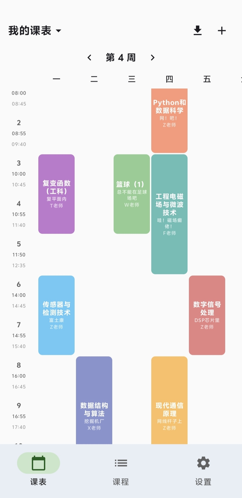
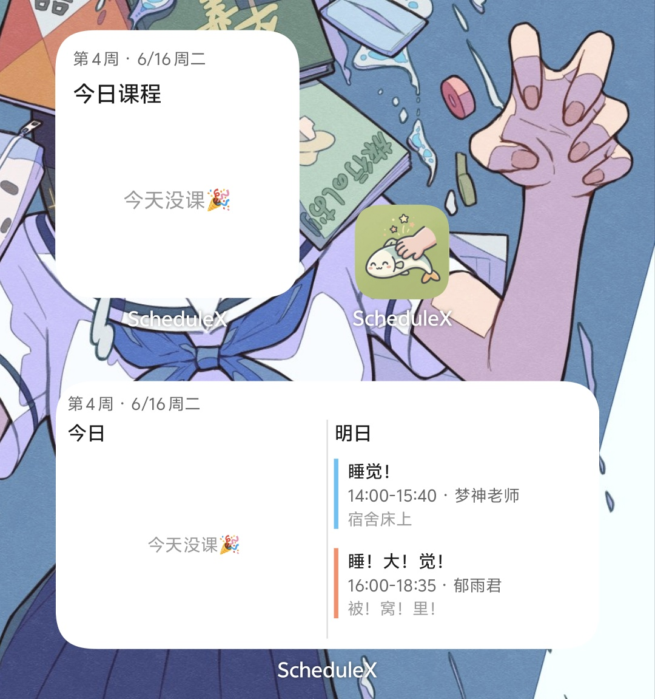

<p align="center">
  
</p>

# ScheduleX

> 一款开源、无广告、永久免费的 Android 课程表应用

<p align="center">
  
  &nbsp;&nbsp;
  
</p>

## ✨ 特性

- 🚫 **永久免费，无广告** — 不追踪、不弹窗、不内购
- 🤖 **智能导入** — 输入教务系统网址，自动识别并导入课表
- 📸 **截图/ PDF 导入** — 拍一张课表截图或选择 PDF，AI 自动识别课程信息
- 🏫 **多教务系统适配** — 支持强智、正方、URP、金智等主流系统
- 📋 **多课表管理** — 支持创建、切换、重命名多个课表
- 🎨 **Material 3 设计** — 现代化 UI，支持深色模式，12 种课程配色
- 📱 **桌面小组件** — 2×2 小课表 + 4×2 大课表，今日/明日课程一目了然
- ⏰ **课前提醒** — 可选 5/10/15/30 分钟提醒，不错过每一节课
- 🔒 **本地存储** — 所有数据保存在手机本地，不上传任何信息
- ⚡ **轻量极速** — 纯 Kotlin + Jetpack Compose，安装包仅 4MB

## 📥 下载

前往 [Releases](https://github.com/mlkgrnt/ScheduleX/releases) 页面下载最新版本 APK。

## 🚀 使用方法

1. 安装 APK，打开应用
2. 点击右上角 **↓** 图标进入导入页面
3. 输入你的教务系统网址（如 `http://jw.xxx.edu.cn`）
4. 应用会自动识别教务系统类型并解析课表
5. 预览确认后一键导入

如果自动解析失败，可以：
- 使用 **截图导入** — 截一张课表图片，AI 识别
- 使用 **PDF 导入** — 选择课表 PDF 文件，AI 识别
- **手动添加** — 点击 **+** 手动录入课程

## 🏫 支持的教务系统

| 系统 | 状态 |
|------|------|
| 强智教务系统 | ✅ 完全支持 |
| 正方教务系统 | ✅ 完全支持 |
| URP 教务系统 | ✅ 完全支持 |
| 金智教务系统 | ✅ 完全支持 |
| 其他系统 | 🔄 AI 兜底解析 |

> 更多系统持续适配中。如果你的学校教务系统不在列表里，欢迎提 Issue 反馈！

## 🛠️ 技术栈

- **语言**: Kotlin
- **UI 框架**: Jetpack Compose + Material 3
- **架构**: MVVM
- **本地存储**: Room + DataStore
- **最低版本**: Android 8.0 (API 26)

## 📦 项目结构

```
app/src/main/java/com/schedulex/
├── data/          # 数据层（Room 数据库、DataStore）
├── ui/            # UI 层（Compose 页面、组件）
│   ├── home/      # 课表主页
│   ├── course/    # 课程管理
│   ├── settings/  # 设置页面
│   └── import_/   # 导入功能
├── llm/           # AI 解析引擎
├── widget/        # 桌面小组件
└── reminder/      # 课前提醒
```

## 🤝 贡献

欢迎提交 Issue 和 Pull Request！

1. Fork 本仓库
2. 创建你的特性分支 (`git checkout -b feature/xxx`)
3. 提交你的改动 (`git commit -m 'Add some feature'`)
4. 推送到分支 (`git push origin feature/xxx`)
5. 打开一个 Pull Request

## 📄 开源协议

本项目基于 [MIT License](LICENSE) 开源。

---

## 🗣️ 作者的碎碎念
演示截图里的睡觉课的任课老师是郁雨君和梦神老师，郁雨君的《梦神老师不可思议》是我童年时很喜欢的儿童文学，特别可爱。就算学业上有再紧迫的事，也要好好睡觉，更不要忘记做梦的意义啊喂！！！

Clementine师傅其实刚做完毕设写完论文答辩完没多久，处于不想干正事但又不想闲着的状态，正好又发现手机里的课程表软件变成了充满广告且需要付费的形状，于是就写了这样一个对自己没有任何用处的APP。

校友可能会发现预设课表和强智教务的适配异常舒适...？别怀疑，这就是学姐（存疑）给你们留下的礼物。

感谢Hermes这两天被我鞭笞了无数次迭代了近一百个版本最后产出了这个小玩意。但是不得不说还是Claude Code用起来省心一点，Hermes很有智慧但还是太难驾驭了。（扶额

总之希望大家玩得开心＆睡个好觉，如果没来得及维护＆适配新特性可以自己fork一下然后想要什么自己写。

---

<p align="center">
  如果觉得有用，请给个 ⭐ Star 支持一下！
</p>
